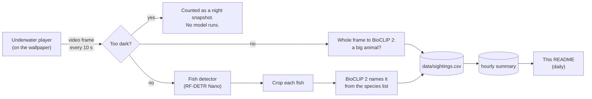

# PierTracker

Live cams from the Scripps Pier in La Jolla, California, running as a Windows desktop
wallpaper, plus an animal tracker that watches the underwater cam and logs what swims by.

- **Monitor 1:** the [Scripps Pier cam](https://scripps.ucsd.edu/piercam) looking over La Jolla Shores.
- **Monitor 2:** the [Under Scripps Pier cam](https://coollab.ucsd.edu/pierviz/), about 4 m down on a pier piling.
- **Tracker:** every 10 seconds it takes a frame from the underwater cam, finds fish and other
  animals, names them, and appends the results to a CSV. Once a day the summary below updates itself.

It is built to stay out of the way. It runs in Windows Efficiency mode, the tracker's models run on the
otherwise idle Intel integrated GPU, and everything unloads while a game or other full-screen app runs.
See [Performance](#performance).

## Tracking results

<!-- RESULTS:START -->
_No results yet. The tracker publishes here once a day after it starts running._
<!-- RESULTS:END -->

## How it works

### The wallpaper (`host/`, the LiveCams app)

A small C# (.NET 8, WinForms) app opens one borderless window per monitor and places it in the
desktop's wallpaper layer, behind the icons. Each window is a WebView2 (Edge) browser that loads the
cam's **official page** and restyles it so only the video player shows, full-screen. Because the page
really is the official one, the embedded players run exactly as the site intends. No streams are copied or
rebroadcast.

- **Scripps Pier cam (Surfline player):** Scripps set this player to pause itself after 5 minutes.
  LiveCams follows that pause. It only resumes the player while someone is actually looking: the monitor
  isn't mostly covered by a window, and there was keyboard or mouse input in the last 2 minutes.
- **Underwater cam (HDOnTap player):** the stream keeps running so the tracker always has frames. To keep
  the desktop calm (at night it's just sensor noise), the picture freezes after 5 minutes. Click the
  desktop on that monitor to go live again.
- **Click the empty desktop** on either monitor to resume that cam, or reload it if the player broke.
- **Full-screen apps (games, videos):** every cam is swapped for a still image and the players are unloaded:
  0% CPU, no network, no GPU. They come back 20 s after the full-screen app closes.
- Analytics, ad and captcha scripts on the cam pages are blocked. None of them are needed to show the cams.
- The app restarts itself if Explorer restarts or the monitor setup changes, and reloads a cam whose
  video stops advancing for 3 minutes.

### How the tracker finds and names animals (`tracker/`)



1. **Frame capture.** The wallpaper copies the current video frame straight from the player (1920×1080,
   without logos or overlays) to `frames/underwater/latest.jpg` every 10 s. No second stream is opened.
2. **Night skip.** The tracker shrinks the frame to 64×36 and checks its brightness and detail. At night
   the camera shows only noise, and those frames are counted but never reach a model.
3. **Detection.** [Community Fish Detector](https://github.com/filippovarini/community-fish-detector)
   (RF-DETR Nano, 640 px, trained on 30+ community fish datasets) draws a box around
   every fish above 0.35 confidence. Overlapping boxes are merged.
4. **Species ID.** Each box is padded, cropped square and embedded by
   [BioCLIP 2](https://huggingface.co/imageomics/bioclip-2), a vision model trained on the Tree of Life
   that can match an image against species names it has never been fine-tuned on (zero-shot). The crop
   is compared with 42 local animals from [`tracker/species.json`](tracker/species.json), described by
   scientific and common names, plus 9 "not an animal" labels (murky water, kelp, pier piling, bubbles,
   a smudge on the lens...).
   - A crop that's clearly one of the "not an animal" labels is dropped.
   - A fish whose best name scores below 0.60 is logged as **fish (unidentified)**. The tracker would
     rather say "a fish" than guess wrong.
5. **Big animals.** Sea lions, rays, divers, jellyfish, or a lobster sitting on the lens often aren't
   boxed as "fish". So the whole frame is also compared against every label, and a big-animal label that
   wins with at least 0.70 probability is logged too.
6. **Logging.**
   - `data/sightings.csv` gets one row per animal type per snapshot:
     `timestamp, date, time, common_name, scientific_name, category, count, confidence`.
   - `data/hourly_summary.csv` rolls these up per hour, with how many snapshots were analyzed and how
     many were dark.
   - Once a day, `tracker/publish_results.py` turns that into the results section above and pushes it.

Both models are converted once to [OpenVINO](https://github.com/openvinotoolkit/openvino) (half
precision). The running tracker needs only OpenVINO, NumPy and Pillow, not PyTorch. It runs the models on
the Intel integrated GPU when there is one, and never on a discrete card. Without one, it uses two CPU
efficiency cores.

### What the numbers mean

- A **snapshot** is one analyzed frame (every 10 s). The tracker doesn't follow individual animals between
  frames, so a garibaldi that hangs around for a minute appears in about 6 snapshots. "Snapshots seen" is
  a measure of **presence over time**, not a head count.
- **Count** is how many of that animal were in a single snapshot. Schools of topsmelt overlap, so large
  schools are undercounted.
- Animals that never move (anemones, mussels on the piling) aren't in the species list on purpose.

## Validation

The models were not trained on this camera, so the tracker's work gets checked two ways.

### 1. Pre-deployment check on reference images

Before going live, the whole pipeline ran on 11 images: clear photos of local species from Wikipedia, and
frames from this cam (a news frame and the cam's own thumbnails). The first run exposed two problems. The
big-animal check reported "octopus" on ordinary fish photos, and some partial crops got confident wrong
names. The thresholds were then raised and the check now has to beat every label. Results after that fix:

| Image | Expected | Tracker output | |
|---|---|---|---|
| Garibaldi | garibaldi | garibaldi (1.00) | ✅ |
| California sheephead | sheephead | California sheephead (1.00) | ✅ |
| Opaleye | opaleye | opaleye (0.98) | ✅ |
| California sea lion, underwater | sea lion | California sea lion (1.00) | ✅ |
| California spiny lobster | lobster | California spiny lobster (1.00) | ✅ |
| Spiny lobster crawling on **this cam's** lens (news frame) | lobster | California spiny lobster (0.73) | ✅ |
| Bat ray | bat ray | bat ray (1.00) + 1 fish (unidentified): a second box on the same ray | ⚠️ |
| Three leopard sharks in kelp | 3 leopard sharks | leopard shark (0.87), **blacksmith (0.81)**, fish (unidentified) | ❌ one wrong name |
| Typical daytime view from **this cam** (tiny, distant fish in green water) | a few specks | nothing: the fish are ~10 px, too small to detect | ⚠️ missed |
| Above-water photo of the pier | nothing | nothing | ✅ |
| **This cam** at night | nothing | skipped as dark | ✅ |

The OpenVINO detector was also checked against the original RF-DETR model on the same images. It found
the same boxes with the same confidences (within 0.01).

**Takeaways:** fish that are clear and close are named reliably. Partial views of long animals (sharks)
can get confident wrong names. Tiny, distant fish in murky water are missed, which is why the stats count
presence rather than claiming a census.

### 2. Ongoing hand-checks on live footage

Clear reference photos flatter any model. The real test is the live cam, which is often green and murky.
So the tracker keeps **one sample crop per animal type every 10 minutes** in `data/crops/<date>/`, named
`<time>_<animal>_<confidence>.jpg`. To check a day:

1. Open `data/crops/<date>` in File Explorer with **Large icons** view.
2. Create a folder named `wrong` in it, even if everything turns out right. This marks the day as checked.
3. Move every crop whose name is wrong into `wrong`.

The next daily publish counts the checked crops and shows precision per animal in the **Validation** table
in the results above. Precision is the share of names that were right. The tallies are kept in
[`results/validation.csv`](results/validation.csv) even after old crops are deleted (after 14 days).
Until some days are checked, the results section says the names are unverified.

**Improving it:** checked crops are exactly the training data needed to go past zero-shot. About 50 crops
per species are enough to train a small classifier on BioCLIP's image embeddings, which usually beats
zero-shot by a wide margin on a specific camera.

## Performance

Measured on the machine this runs on: i7-13700K, Radeon RX 7800 XT, Intel UHD 770, 32 GB RAM.

| State | CPU | GPU | RAM |
|---|---|---|---|
| Both cams live + tracker (between frames) | ~0.8% of total CPU | Radeon: 0.25% 3D; video decode on its separate decode engine | ~2.5 GB |
| Tracker, per daytime frame | ~0.03–0.1 s of CPU time | ~0.4–0.9 s on the Intel iGPU | (included above) |
| Tracker, per night frame | ~0 (no model runs) | none | models unloaded after 10 min dark: ~1.1 GB freed |
| Full-screen game or app running | 0.0% | none | ~0.7 GB, idle (tracker models unloaded after 10 min) |
| Turned off (`--off`) | nothing running | none | 0 |

How it stays light:
- Every process runs in Windows **Efficiency mode**: idle priority plus EcoQoS, which keeps it on the
  efficiency cores.
- The tracker's GPU calls use OpenVINO's low-priority queue, so the CPU sleeps while the iGPU works
  instead of spinning. Measured: 156 ms → 3–25 ms of CPU per model run.
- The desktop-click hook runs on its own time-critical thread, so it can never add mouse lag. It is removed
  entirely during games.
- If the app dies, a Windows job object takes the tracker down with it.

## Setup

Requirements:
- Windows 10 or 11
- [.NET 8 SDK](https://dotnet.microsoft.com/download) to build the app
- WebView2 Runtime (preinstalled on Windows 11)
- Python 3.12 for the tracker
- Optional: an Intel integrated GPU for the tracker's models

```powershell
git clone https://github.com/joshuafrommeyer-35/PierTracker.git
cd PierTracker

# 1. Build the wallpaper app into .\app
dotnet publish host -c Release -o app

# 2. Tracker environment (CPU-only PyTorch first so nothing pulls a CUDA build)
py -3.12 -m venv tracker\.venv
tracker\.venv\Scripts\pip install torch==2.14.0 torchvision==0.29.0 --index-url https://download.pytorch.org/whl/cpu
tracker\.venv\Scripts\pip install -r tracker\requirements-setup.txt

# 3. Download and convert the models (about 1.9 GB download, 2-3 minutes)
tracker\.venv\Scripts\python tracker\setup_models.py

# 4. Check livecams.json: monitors are numbered left to right. Then start it:
app\LiveCams.exe --on
```

Re-run `setup_models.py` after editing `tracker/species.json`. To publish results to your own fork, set
`"publishResults": true` in `livecams.json`. It commits and pushes with your normal git credentials.

## Usage

| Do this | What happens |
|---|---|
| `app\LiveCams.exe --on` | Cams and tracker start, and start again at every login |
| `app\LiveCams.exe --off` | Each monitor freezes on its current cam picture (saved as a normal Windows wallpaper), then everything shuts down. Nothing keeps running. Removes the login start |
| `app\LiveCams.exe --quit` | Shuts down without freezing; your normal wallpaper comes back |
| Click the empty desktop on a cam's monitor | Resumes that cam, or reloads it if it's broken. On the underwater monitor: go live again |
| Tray icon (wave) | Status on hover. Menu: resume a cam, reload, open the folder, turn off. Double-click resumes everything |

### `livecams.json`

| Setting | Meaning |
|---|---|
| `cams[].monitor` | Monitor number, counted left to right |
| `cams[].page` / `iframe` | The official page, and the CSS selector of its player |
| `cams[].extraBottomPx` | Pushes a toolbar under the video off-screen (Surfline: 40) |
| `cams[].mode` | `alwaysOn` (keep streaming) or `resumeWhenWatched` (follow the player's own pause) |
| `cams[].freezeDisplayAfterSeconds` | Freeze the on-screen picture after this long, while the stream keeps running |
| `cams[].captureEverySeconds` / `captureDir` | Save a frame for the tracker this often |
| `watchedIdleSeconds` / `coverThreshold` | What counts as "someone is looking" |
| `pauseDuringFullscreenApps` | Unload the cams during games and other full-screen apps |
| `tracker.enabled` / `publishResults` | Run the tracker; push daily results to GitHub |
| `debugPort` | Troubleshooting only (Chrome DevTools on localhost). Keep at 0 |

### Files it writes (local only, not committed)

| Path | Contents |
|---|---|
| `data/sightings.csv` | Every sighting: one row per animal type per snapshot |
| `data/hourly_summary.csv` | Per hour: snapshots analyzed, dark snapshots, and per animal the snapshots seen and max count |
| `data/crops/<date>/` | Sample crops for validation (kept 14 days) |
| `frames/` | The latest tracker frame, and the stills used by `--off` |
| `logs/host.log`, `logs/tracker.log` | What the app and tracker did |

## Project layout

```
host/                 LiveCams wallpaper app (C#, .NET 8, WebView2)
tracker/
  tracker.py          the background tracker
  setup_models.py     one-time model download + OpenVINO conversion
  publish_results.py  daily README/results update
  species.json        the animals it can name (edit to taste)
results/              published summaries (daily_summary.csv, validation.csv)
livecams.json         configuration
```

## Credits

- **Cams:** [Scripps Institution of Oceanography](https://scripps.ucsd.edu/piercam) (UC San Diego). The
  underwater cam is run by Scripps' [Coastal Ocean Observing Lab](https://coollab.ucsd.edu/pierviz/) and
  streamed by [HDOnTap](https://hdontap.com/). The pier cam is by [Surfline](https://www.surfline.com/).
  This project only displays their official players. Frames are analyzed on the local PC and never
  uploaded, and only summary numbers are published.
- **Models:**
  - [Community Fish Detector](https://github.com/filippovarini/community-fish-detector) (Apache-2.0)
    on [RF-DETR](https://github.com/roboflow/rf-detr) (Apache-2.0)
  - [BioCLIP 2](https://huggingface.co/imageomics/bioclip-2) by Imageomics (MIT), loaded with
    [OpenCLIP](https://github.com/mlfoundations/open_clip)
- **Runtime:** [OpenVINO](https://github.com/openvinotoolkit/openvino) (Apache-2.0),
  [WebView2](https://developer.microsoft.com/microsoft-edge/webview2/).
