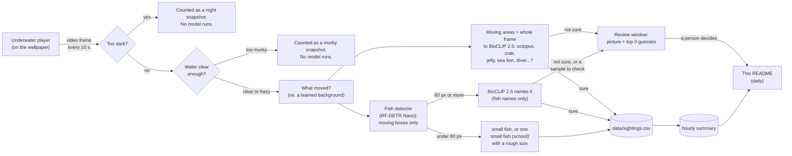

# PierTracker

Live cams from the Scripps Pier in La Jolla, California, running as a Windows desktop
wallpaper, plus an animal tracker that watches the underwater cam and logs what swims by.

- **One monitor:** the [Scripps Pier cam](https://scripps.ucsd.edu/piercam) looking over La Jolla Shores.
- **The other:** the [Under Scripps Pier cam](https://coollab.ucsd.edu/pierviz/), about 4 m down on a pier piling.
- **Tracker:** every 10 seconds it takes a frame from the underwater cam, finds fish, octopus, crabs,
  rays, sea lions and more, names them, and appends the results to a CSV. Schools are logged as schools,
  not as hundreds of fish. Sightings it isn't sure about are saved as pictures for a person to approve.
  Hourly conditions at the pier (water temperature, turbidity, chlorophyll, tide...) are recorded alongside.
  Once a day the summary below updates itself.

It is built to stay out of the way. It runs in Windows Efficiency mode, the tracker's models run on the
otherwise idle Intel integrated GPU, and everything unloads while a game or other full-screen app runs.
See [Performance](#performance).

## Tracking results

<!-- RESULTS:START -->
_No results yet. The tracker publishes here once a day after it starts running._
<!-- RESULTS:END -->

## How it works

### The wallpaper (`host/`, the LiveCams app)

A small C# (.NET 8, WinForms) app opens one borderless window per monitor and places it in the
desktop's wallpaper layer, behind the icons. Each window is a WebView2 (Edge) browser that loads the
cam's **official page** and restyles it so only the video player shows, full-screen. Because the page
really is the official one, the embedded players run exactly as the site intends. No streams are copied or
rebroadcast.

- **Scripps Pier cam (Surfline player):** Scripps set this player to pause itself after 5 minutes.
  LiveCams follows that pause. It only resumes the player while someone is actually looking: the monitor
  isn't mostly covered by a window, and there was keyboard or mouse input in the last 2 minutes.
- **Underwater cam (HDOnTap player):** the stream keeps running so the tracker always has frames. To keep
  the desktop calm (at night it's just sensor noise), the picture freezes after 5 minutes. Click the
  desktop on that monitor to go live again.
- **Click the empty desktop** on either monitor to resume that cam, or reload it if the player broke.
- **Full-screen apps (games, videos):** every cam is swapped for a still image and the players are unloaded:
  0% CPU, no network, no GPU. They come back 20 s after the full-screen app closes.
- Analytics, ad and captcha scripts on the cam pages are blocked. None of them are needed to show the cams.
- The app restarts itself if Explorer restarts or the monitor setup changes, and reloads a cam whose
  video stops advancing for 3 minutes.

### How the tracker finds and names animals (`tracker/`)



1. **Frame capture.** The wallpaper copies the current video frame straight from the player (1920×1080,
   without logos or overlays) to `frames/underwater/latest.jpg` every 10 s. No second stream is opened.
2. **Night skip.** The tracker shrinks the frame to 64×36 and checks brightness, detail and color. At
   night the camera shows only purple-grey noise, and in daylight the water here is green. Night frames are
   counted but never reach a model.
3. **Murky water.** Every frame gets a **visibility** score: how much fine detail is left (edges of
   pilings, fish, growth), which murky water washes out. Clear water here scores 2–3. It's averaged over
   3 frames so the state doesn't flicker.
   - **Hazy** (below 1.4): fish and schools are still counted, but no species are named. Only a
     look-alike group at 95%+ is logged, and nothing goes to the review queue, since a person couldn't
     judge it either.
   - **Too murky** (below 0.2): nothing is identified. The frame is logged as murky, like a night frame,
     and it doesn't count as effort. A murky day then reads "couldn't see", not "no fish".
   - The cutoffs come from a test (see Validation): as simulated murk increased, naming accuracy fell
     from 92% to 50% long before detection gave out.
4. **Motion.** The camera never moves, so the tracker keeps a slowly updated background of the scene,
   covering roughly the last 100 seconds, and marks what changed. Pilings, the rope hanging from the pier
   and the growth on them never move. The live test showed they are the main source of false sightings,
   so anything that didn't move is ignored.
5. **Fish.** [Community Fish Detector](https://github.com/filippovarini/community-fish-detector)
   (RF-DETR Nano, 640 px, trained on 30+ community fish datasets) boxes fish above 0.35 confidence, and
   only boxes where something moved are kept.
   - **Under 80 px** (most of the school, silhouetted against the surface) isn't named. Nobody can tell a
     topsmelt from a sardine at that size. When there are five or more, the whole school is logged once
     per snapshot as **small fish (school)**. Its size is estimated by counting the small moving specks,
     because the detector only boxes a few of them. The estimate is rounded (~150, ~400) to avoid false
     precision. Fewer than five are logged as **small fish**.
   - **80 px and up** is cropped and embedded by [BioCLIP 2.5](https://huggingface.co/imageomics/bioclip-2.5-vith14),
     a vision model trained on the Tree of Life that can match an image against species names it has never
     been fine-tuned on (zero-shot). The crop is compared only with the **fish** among the 70 animals in
     [`tracker/species.json`](tracker/species.json), plus 9 "not an animal" labels (murky water, kelp, pier
     piling...). So a blurry fish can't come out as an octopus.
   - **Look-alike groups.** Many mistakes are between look-alikes: topsmelt vs. jacksmelt vs. anchovy vs.
     sardine, or opaleye vs. halfmoon. So when no species reaches **0.85** but the model is sure it's one
     of a group (their probabilities add up to **0.90+**), the **group** is logged instead: "silversides &
     sardines", "surfperches", "sea basses", "grunts (salema, sargo)" and so on (see `species.json`).
     Otherwise it's **fish (unidentified)**.
   - **Following fish across frames.** When a fish big enough to name shows up, LiveCams is asked for
     a frame every ~3 s for 20 s (at most 10 min of this per hour). Detections close to where the fish
     was a moment ago are treated as the same fish, and it's named from the **average of all its
     looks**, which is steadier than any single frame. In a test that was ~5 points more accurate (see
     Validation). Each fish becomes one row in the database's `visits` table (arrival, departure, looks,
     name), so individual visits can be counted, not just snapshots. Other animals (a lobster on the
     piling, a turtle, a seal) are one visit as long as they keep showing up within 5 minutes. The extra burst frames feed only
     the naming and the visits, never the snapshot statistics, because bursts happen exactly when fish
     are around and would inflate them.
   - Once the **camera-trained classifier** has learned from enough review answers (see
     [Learning from the data](#learning-from-the-data)), its answer is used first for the animals it
     knows.
6. **Everything else.** The fish detector doesn't box octopus, crabs, lobsters, jellyfish, sea hares,
   sea lions or divers. So the biggest moving areas (larger than a small fish), and the whole frame when a
   lot of it moved, are compared against every label (70 animals + 9 "not an animal"). A "scene" animal
   (marked in `species.json`) counts when it wins with at least 0.70 probability. In a small moving area
   it needs 0.90, or it has to show up again within 30 s: a real lobster stays put, but a flicker of fish
   at a piling edge doesn't.
7. **A person has the last word.** Two kinds of pictures go to the review window (`data/review/pending`):
   - **"Not sure"**: a fish whose best name scored 0.25–0.85, or a non-fish between 0.40 and the bar
     above. It is logged as unidentified, or not at all, until someone looks.
   - **"Is this right?"**: a sample of the names the tracker *did* log. At most one per animal per hour,
     plus every rare non-fish sighting. The answers are the published accuracy.

   Each picture shows the close-up, where it was in the frame, and the top 3 guesses. There are at most
   ~10 an hour. See [Reviewing uncertain sightings](#reviewing-uncertain-sightings).
8. **Logging.**
   - `data/sightings.csv` gets one row per animal type per snapshot:
     `timestamp, date, time, common_name, scientific_name, category, count, confidence, method`.
     `method` is how it was named: `zero-shot` (BioCLIP), `camera-trained`, or `detector only` (small or
     unidentified fish).
   - `data/hourly_summary.csv` rolls these up per hour, with how many snapshots were analyzed and how
     many were dark.
   - Five or more of one named kind in a snapshot is logged once as **"<kind> (school)"**, for example
     "blacksmith (school)", with the count.
   - Once a day, `tracker/publish_results.py` turns that into the results section above and pushes it.

Both models are converted once to [OpenVINO](https://github.com/openvinotoolkit/openvino) (half
precision). The running tracker needs only OpenVINO, NumPy and Pillow, not PyTorch. It runs the models on
the Intel integrated GPU when there is one, and never on a discrete card. Without one, it uses two CPU
efficiency cores.

### Conditions at the pier (`tracker/environment.py`)

Once a day the tracker fetches hourly conditions from two public, quality-controlled sources on the pier
itself, and saves them next to the sightings (`data/environment_hourly.csv`, published as
[`results/environment_hourly.csv`](results/environment_hourly.csv)):

| Source | Measures | Notes |
|---|---|---|
| [NOAA tide gauge 9410230 "La Jolla"](https://tidesandcurrents.noaa.gov/stationhome.html?id=9410230) | Predicted tide and observed water level (m above MLLW), rising/falling, water and air temperature, wind, air pressure | Official NOAA data |
| [SCCOOS Automated Shore Station, Scripps Pier](https://sccoos.org/autoss/) | Water temperature, salinity, dissolved oxygen, pH, turbidity, chlorophyll | Sensors ~5 m deep, next to the camera's ~4 m. Only readings that passed the station's [QARTOD](https://ioos.noaa.gov/project/qartod/) quality tests are kept |
| Same shore station, daily means since 2013 | **Temperature anomaly**: how much warmer or colder than normal the water is for that date | Normal for each date = 2013–2025 mean, smoothed ±15 days. Late September's normal is ~20 °C; on 2026-09-25 the water was **+2.6 °C** above it |
| [NOAA Oceanic Niño Index (ONI)](https://www.cpc.ncep.noaa.gov/data/indices/oni.ascii.txt) | The official El Niño / La Niña measure (El Niño at +0.5 or more) | 2026 is an El Niño year: ONI +1.8 for Jun–Aug, and NOAA's El Niño Advisory gives >90% odds of a very strong event this fall and winter |

The sources were checked before use:
- On the first day, NOAA's water temperature (22.5 °C) and the shore station's (22.46 °C) agreed.
- One of the station's two chlorophyll sensors wasn't reporting, so the working one is used.
- About 12% of turbidity readings fail quality control, and those are dropped.

Each value is the median of that hour's readings. Two public files, from the least to the most detail:
- [`results/daily_conditions.csv`](results/daily_conditions.csv): one row per day, with water temperature
  (mean, min, max, normal for the date, anomaly), turbidity, chlorophyll, salinity, oxygen, pH, tide
  range, air temperature, wind, the El Niño index, and that day's clear/murky tracking effort and
  sightings. The README shows the headline, a temperature chart and a folded table.
- [`results/environment_hourly.csv`](results/environment_hourly.csv): every hour, to join with the hourly
  sightings (`results/hourly_summary.csv`) on `date` + `hour`. Recording through a strong El Niño makes this a good season to
start: warm-water visitors and missing regulars should both show up against the temperature anomaly.

### What the numbers mean

- A **snapshot** is one analyzed frame (every 10 s). The tracker doesn't follow individual animals between
  frames, so a garibaldi that hangs around for a minute appears in about 6 snapshots. "Snapshots seen" is
  a measure of **presence over time**, not a head count.
- **Count** is how many of that animal were in a single snapshot. For a school of small fish it's a
  rounded estimate from the moving specks. It gets the order of magnitude right (a hundred vs. a few
  hundred), not the exact number.
- Animals that never move (anemones, mussels on the piling) aren't in the species list on purpose.

## Validation

The models were not trained on this camera, so the tracker's work gets checked two ways.

### 1. Pre-deployment check on reference images

Before going live, the whole pipeline ran on 11 images: clear photos of local species from Wikipedia, and
frames from this cam (a news frame and the cam's own thumbnails). The first run exposed two problems. The
big-animal check reported "octopus" on ordinary fish photos, and some partial crops got confident wrong
names. The thresholds were then raised and the check now has to beat every label. Results after that fix:

| Image | Expected | Tracker output | |
|---|---|---|---|
| Garibaldi | garibaldi | garibaldi (1.00) | ✅ |
| California sheephead | sheephead | California sheephead (1.00) | ✅ |
| Opaleye | opaleye | opaleye (0.98) | ✅ |
| California sea lion, underwater | sea lion | California sea lion (1.00) | ✅ |
| California spiny lobster | lobster | California spiny lobster (1.00) | ✅ |
| Spiny lobster crawling on **this cam's** lens (news frame) | lobster | California spiny lobster (0.73) | ✅ |
| Bat ray | bat ray | bat ray (1.00) + 1 fish (unidentified): a second box on the same ray | ⚠️ |
| Leopard shark with two dark fish, in kelp | leopard shark + 2 fish | leopard shark (0.87), blacksmith (0.83), and 1 fish sent to review (halfmoon 45% / blacksmith 42%) | ⚠️ the fish look like blacksmith or halfmoon; the photo can't settle it |
| Typical daytime view from **this cam** (tiny, distant fish in green water) | a few specks | nothing: the fish are ~10 px, too small to detect | ⚠️ missed |
| Above-water photo of the pier | nothing | nothing | ✅ |
| **This cam** at night | nothing | skipped as dark | ✅ |

The OpenVINO detector was also checked against the original RF-DETR model on the same images. It found
the same boxes with the same confidences (within 0.01).

The tile scan was tested on the same images and added no false sightings.

**Takeaways:** fish that are clear and close are named reliably. Look-alike species (blacksmith, halfmoon,
opaleye) come out as close calls, and those go to the review queue instead of into the stats. Tiny,
distant fish in murky water are missed, which is why the stats count presence rather than claiming a
census.

One honest correction from testing: that shark photo was first described here as "three leopard sharks",
and "blacksmith" was counted as a wrong name. The review picture showed two dark fish next to one shark.
Reviewing the tracker's pictures catches mistakes in both directions.

### 2. First live morning (2026-09-25)

The first version ran on the live cam from sunrise to 08:40 and got a lot wrong. Here's what a look through
its 84 sample crops and 208 review pictures showed:

| Problem | Example | Fix |
|---|---|---|
| Pilings and the hanging rope boxed as fish and given fish names | the rope logged as "sargo" (0.79), a piling as "salema" | Motion filter: things that don't move are ignored |
| Tiles of the piling named as crabs | "sheep crab" at up to 0.89 on bare piling | Tile scan replaced by moving areas only |
| Small fish given non-fish names | 40–60 px fish logged as "octopus", "jellyfish", "bat ray" | Fish-detector boxes get fish names only |
| Tiny backlit fish given confident species names | 50 px silhouettes as "blacksmith" (0.9+) | Under 80 px: "fish (unidentified)" |
| A night frame got through | noise with a bright blob at 04:40 | Night check also looks at color |
| Review queue flooded | 208 pictures in ~2 hours | At most ~10 an hour, only things a person can judge |
| A school of hundreds logged as individual fish | "11 fish (unidentified)" every 10 s | One "small fish (school)" sighting per snapshot, with a rough size |

The fixed version was replayed on 29 consecutive live frames (5 minutes) and then deployed. The data
logged before the fix was set aside and isn't in the results.

On those 5 minutes the fixed version logged:

| Result | Verdict |
|---|---|
| 136 fish (unidentified) | ✅ the school, honestly unnamed |
| 1 **kelp bass** (0.99): a big blotchy bass cruising past a piling | ✅ looks right |
| 2 Pacific sardine | ✅ plausible: slender, silvery |
| A "spiny lobster" at a piling edge (0.72) | Held back and sent to review. I first judged it "fish passing a cable". But the long curved "cable" and the lumpy shape at the piling were **gone an hour later**, so it was almost certainly a real lobster, with its long antennae. The model saw it; the quick human look didn't. |
| 23 **blacksmith** (0.94–0.99) | ❓ doubtful. Several crops look like yellow **señoritas** or olive fish, not dark blacksmith. BioCLIP is overconfident on green, blurry footage. |

### 3. Fixing the overconfidence: a controlled test

Live footage has no answer key, so the next test used one. 150 research-grade iNaturalist photos of
25 local species were made to look like this camera:
- the fish shrunk to 80–130 px
- the water's color cast applied: red nearly gone, measured from real frames as green in the morning
  and blue at midday
- JPEG compression and noise added

That gave 300 test images, and each method was scored the way the tracker uses it.

| Method | Top guess right | Of names logged at ≥0.6, right | Of names logged at ≥0.9, right |
|---|---:|---:|---:|
| BioCLIP 2 (the first version) | 46% | 57% | 67% (22% of images named) |
| BioCLIP 2 + color correction | 22% | 28% | 49% |
| **BioCLIP 2.5** | **53%** | **64%** | **79% (49% named)** |
| BioCLIP 2.5 + color correction | 39% | 49% | 69% |

- **Color correction makes it much worse.** The model knows blue-green underwater photos, and "fixing"
  the colors distorts what it relies on. It isn't used.
- **BioCLIP 2.5 is better at every cutoff,** so the tracker switched to it. It runs on the iGPU,
  using ~0.65 GB more memory.
- **The cutoffs were then tuned on the deployed model** (OpenVINO, iGPU). With species at 0.85 and
  look-alike groups at 0.90, **81% of logged names were right**, with 56% of fish named. The rest are
  logged as unidentified rather than guessed. The first version's 0.6 cutoff gave ~57–64%.
- **Other models tested and not used:**
  - iNaturalist-trained classifiers (EVA-02, ConvNeXt on iNat 2021) know only 10 of 30 key local
    species: no blacksmith, señorita, topsmelt, sardine or anchovy. A trained classifier can't name what
    it wasn't trained on, and their license is non-commercial.
  - Orange's [marine-detect](https://github.com/Orange-OpenSource/marine-detect) MegaFauna model
    (sharks, rays, turtles) found 0 of 48 sharks and rays pasted into real pier frames. On clean photos
    it called leopard sharks "turtle". It was trained on tropical reef species.

**Murky-water calibration.** Sixty known fish were pasted into real pier frames, and haze + blur was
increased step by step:

| Murk | Visibility score | Fish found | Names right |
|---|---:|---:|---:|
| none | 2.3 | 63% | 92% |
| light | 1.6 | 57% | 81% |
| moderate | 1.1 | 58% | 50% |
| heavy | 0.5 | 68% | 29% |
| very heavy | 0.27 | 67% | 21% |
| near-opaque | 0.12 | 33% | 0% |

Counting holds up far longer than naming, which sets the two cutoffs: hazy below 1.4 (count only) and
too murky below 0.2 (nothing). Real clear frames today score 2.1–3.1. Once there's murky weather, the
score can be checked against the pier's turbidity sensor (a good SQL exercise).

**Three more ideas, tested the same way:**

| Idea | Result | Used? |
|---|---|---|
| Test-time augmentation (classify flipped/re-cropped copies and average) | No gain in accuracy (79% vs 80%), fewer fish named | No |
| Averaging several looks at the same fish (proxy for following it across frames) | **85% of names right vs 80%**, fewer fish named | **Yes**: burst frames + visits |
| Local species priors from iNaturalist records near the pier | Not used on its own: iNaturalist reflects what divers photograph (6 sardine records, but sardines school here constantly). The camera-trained classifier learns this camera's real frequencies from review answers instead. | Its species list, yes |

**The species list.** iNaturalist research-grade records within 1.5 km of the pier showed locally
common fish missing from the list. The model can only answer with names it's given, so a zebra-perch
swimming by was *forced* into a wrong name. 13 were added (zebra-perch sea chub, giant kelpfish, ocean
whitefish, rockfishes, croakers, sanddab, lizardfish, greenling, cabezon, grunion, diamond stingray,
banded guitarfish), for 57 animals (three later removed, see below). On known-species photos of all 38
species tested:

| Species list | Photos of the original 25 | Photos of the 13 added | All 38 |
|---|---:|---:|---:|
| 44 animals | 75% of names right | 11% (no right name available) | 56% |
| 57 animals | 70% | 82% | **74%** |

The cost is that new labels sometimes "steal" answers: ocean whitefish took 3 and zebra-perch 4 of 456.

**Then the deep-water species were taken out again.** On the live cam, the small, yellow-tailed fish
schooling near the pilings went from mostly "blacksmith" to mostly "ocean whitefish". The field guides
settle it:
- Juvenile blacksmith are blue-grey in front and bright yellow-orange behind until ~5 cm
  ([Aquarium of the Pacific](https://www.aquariumofpacific.org/onlinelearningcenter/species/blacksmith)),
  and school in midwater around structure.
- Ocean whitefish live 10–91 m down, mostly 24–55 m, near the bottom
  ([CDFW](https://marinespecies.wildlife.ca.gov/ocean-whitefish/the-species/)). They are unlikely at 4 m.

The iNaturalist records that suggested ocean whitefish and rockfish come from dives in the nearby La
Jolla Canyon. A direct test confirmed it: 10 photos of *juvenile* blacksmith, degraded to camera
quality, came out "ocean whitefish" 11 times out of 30 (confidently) and "blacksmith" only 6. Without
the three deep-water species (ocean whitefish, vermilion and brown rockfish), no confident wrong names
were left: 7 blacksmith, 6 leaning blacksmith but below the cutoff, the rest unsure. That left 54
animals, all plausible at ~4 m.

**Then what's actually been seen on this camera.** The cam's [highlight
clips](https://hdontap.com/stream/018408/scripps-pier-underwater-live-webcam/clips/highlight/), the
Scripps/CoOL pages, news stories and viewer forums list:
- a **sea turtle** (clip from 2026-09-22; La Jolla Shores has resident green turtles)
- octopus, seals, a stingray, leopard sharks, cormorants diving, lobsters, giant sea bass
- a baby garibaldi, mysid shrimp swarms, and swimmers

Fishing and diving reports add seasonal and El Niño visitors: mackerel, bonito, barracuda and yellowtail
(all reported at La Jolla in 2026), croakers, pelagic red crabs (they swarmed La Jolla Shores in the
2015 El Niño), pufferfish and triggerfish.

17 candidates were tested the same way, on photos of every current and candidate species:

| Species list | Photos of current species | Photos of candidates | Juvenile blacksmith | All |
|---|---:|---:|---:|---:|
| 54 animals | 77% of names right | 8% | 6/20 | 57% |
| + candidates | 78% | 72% | 6/20 | **76%** |

- **15 were added:** green sea turtle (right 10 of 12), market squid (9/12), queenfish (8/12),
  finescale triggerfish (7/12), chub and jack mackerel, bonito, barracuda, yellowtail, white seaperch,
  barred surfperch, white and yellowfin croaker, pelagic red crab and bullseye pufferfish. Most took 0–1
  answers from other species.
- **2 were left out:** thornback ray (never right, took 2 answers) and olive ridley turtle (always
  called green sea turtle, so it added nothing).
- **Also added:** "swimmer or snorkeler", next to scuba diver.

The list is now **70 animals**.

**Also looked at:**
- NOAA's [AI for protected species](https://www.fisheries.noaa.gov/new-england-mid-atlantic/science-data/using-artificial-intelligence-study-protected-species)
  uses the same human-in-the-loop active learning as the review queue.
- [Li et al. 2025](https://doi.org/10.1109/JOE.2024.3455565) pretrain on unlabeled underwater footage
  (see Next steps; it's the reason for the frame bank).

These are synthetic tests, closer to the camera than clean photos but not the real thing. The review
answers are the real measure, and they're what the **Checked** column shows.

That last row is why every name in the results carries a **Checked** column, and why the review window
samples confident names too. Until people check them, the names are the model's guesses.

### 4. Ongoing hand-checks on live footage

Clear reference photos flatter any model. The real test is the live cam, which is often green and murky.
So the tracker keeps **one sample crop per animal type every 10 minutes** in `data/crops/<date>/`, named
`<time>_<animal>_<confidence>.jpg`. To check a day:

1. Open `data/crops/<date>` in File Explorer with **Large icons** view.
2. Create a folder named `wrong` in it, even if everything turns out right. This marks the day as checked.
3. Move every crop whose name is wrong into `wrong`.

The next daily publish counts the checked crops and shows precision per animal in the **Validation** table
in the results above. Precision is the share of names that were right. The tallies are kept in
[`results/validation.csv`](results/validation.csv) even after old crops are deleted (after 14 days).
Until some days are checked, the results section says the names are unverified.

### 5. Uncertain sightings, checked by a person

The review window is the main check. Answers to **"Is this right?"** pictures become the **Checked**
column and the **Validation** table. **"Not sure"** pictures that a person approves are listed in
**Confirmed by hand**, separately from the automatic counts. That's also how rarer animals get recorded
when the model hesitates.

**Improving it:** checked crops and approved review pictures are exactly the training data needed to go
past zero-shot. About 50 per species are enough to train a small classifier on BioCLIP's image embeddings,
which usually beats zero-shot by a wide margin on a specific camera.

## The database (SQL)

Everything the tracker sees also goes into a SQLite database, `data/piertracker.db`, with these tables:
- `snapshots`: every analyzed frame, with its visibility and whether it was dark or murky
- `visits`: each fish followed across frames, from arrival to leaving
- `sightings`
- `species`
- `conditions`
- `reviews`: answers from the review window

Questions that combine them are one query. For example, which hours had kelp bass while the water was
2 °C above normal? The CSVs stay for the public results; the database is the place to explore.

- `tracker\.venv\Scripts\python tracker\sql.py` opens a small SQL shell on a **sandbox copy**, which
  you can break freely (`.reset` for a fresh copy). Add `--live` for the live database, read-only.
- [`docs/SQL_WALKTHROUGH.md`](docs/SQL_WALKTHROUGH.md) teaches SQL with this data: filtering, grouping,
  joins, rates vs. counts, views and window functions.

## Learning from the data

Both pieces are built, tested, and run automatically. They switch themselves on when there's enough data.
A nightly job (`tracker/nightly.py`, started by the tracker after midnight at idle priority) runs:

1. `environment.py`: fetches the day's conditions.
2. `ml/train_classifier.py`: retrains the camera classifier from the review answers.
3. `ml/conditions_model.py`: refits "what brings animals in".
4. `publish_results.py`: updates this README (if publishing is on).

### Camera-trained classifier (`tracker/ml/train_classifier.py`)

BioCLIP matches pictures against species *names*. It has never seen this camera's green-blue, blurry,
backlit footage, which is where its overconfidence comes from. Every review picture stores BioCLIP's
image embedding (1,024 numbers describing the picture), and your answer is its label.

- **How it trains:** a logistic regression on those embeddings learns what each animal looks like *on
  this camera*. "Not an animal" answers are a class too, so it also learns to throw away piling edges.
- **When it switches on:** an animal is learned at **12 answers** (~30 makes it reliable), and it needs
  at least 3 animals. The classifier is only used if it beats zero-shot BioCLIP by 5+ points in
  cross-validation on the same pictures.
- **How it's used:** the tracker picks it up automatically and uses its answer when it's 70%+ sure. Every
  sighting records which method named it.
- **Progress:** the review window shows the answer count. The report is at
  [`results/camera_classifier.md`](results/camera_classifier.md); run
  `tracker\.venv\Scripts\python tracker\ml\train_classifier.py --status` to check it anytime.
- **Tested** on synthetic data: it trains, cross-validates, beats the baseline and switches on.

### What brings animals in (`tracker/ml/conditions_model.py`)

For each animal seen in 30+ hours, this fits a negative binomial regression (counts that come in bursts)
of snapshots per daylight hour, with the hour's daylight snapshots as exposure. The predictors are:
- how much warmer than normal the water is (the local El Niño signal)
- turbidity and chlorophyll
- tide height, and whether it's rising
- time of day
- the El Niño index, once the data spans months where it changes

Results are rate ratios per typical (1 SD) change with 95% intervals, in
[`results/conditions_model.md`](results/conditions_model.md). It starts after **21 days** of data.

- **Tested:** on synthetic data with a planted "1.6× more sightings per SD of warmer water" effect, it
  recovered 1.71× (95% CI 1.56–1.87) and correctly found no effect for the other conditions.
- **Caveats:** it shows associations, not causes. Neighbouring hours aren't independent, so the intervals
  are optimistic.

### Next steps once there's a season of data

- **Occupancy models** separate "not there" from "there but too murky to see", using turbidity and time
  of day as detection covariates.
- **Forecasts:** the odds of a sea lion or a ray in the next hour, given the tide and conditions now.
- **A detector fine-tuned on this camera's small fish** would count schools much better than the
  motion-speck estimate. Two pieces of prior work point the way:
  - **Pretraining on our own footage.** [Li et al. 2025, *Self-Supervised Marine Organism
    Detection*](https://doi.org/10.1109/JOE.2024.3455565) pretrain a detector's backbone on 40,000
    *unlabeled* underwater images, with underwater-style augmentations (CLAHE, Retinex, motion blur) used
    during training, then fine-tune it on a few labels. For that, the tracker banks frames from this
    camera: one every 20 min, plus one every 5 min while a named animal is in view
    (`data/frame_bank/`, 90 days).
  - **Labeling tools.** NOAA's protected-species work uses [VIAME](https://www.viametoolkit.org/) and
    its DIVE annotation tool, with the same human-in-the-loop active learning as the review queue here.
    DIVE is a good way to draw boxes on banked frames.

## Performance

Measured on the machine this runs on: i7-13700K, Radeon RX 7800 XT, Intel UHD 770, 32 GB RAM.

| State | CPU | GPU | RAM |
|---|---|---|---|
| Both cams live + tracker (between frames) | ~0.8% of total CPU | Radeon: 0.25% 3D; video decode on its separate decode engine | ~3.2 GB |
| Tracker, per daytime frame | ~0.03–0.1 s of CPU time | ~1–3 s on the Intel iGPU with BioCLIP 2.5 (more when many fish are close) | (included above) |
| Tracker, per night frame | ~0 (no model runs) | none | models unloaded after 10 min dark: ~1.1 GB freed |
| Full-screen game or app running | 0.0% | none | ~0.7 GB, idle (tracker models unloaded after 10 min) |
| Turned off (`--off`) | nothing running | none | 0 |

How it stays light:
- Every process runs in Windows **Efficiency mode**: idle priority plus EcoQoS, which keeps it on the
  efficiency cores.
- The tracker's GPU calls use OpenVINO's low-priority queue, so the CPU sleeps while the iGPU works
  instead of spinning. Measured: 156 ms → 3–25 ms of CPU per model run.
- The desktop-click hook runs on its own time-critical thread, so it can never add mouse lag. It is removed
  entirely during games.
- If the app dies, a Windows job object takes the tracker down with it.

## Setup

Requirements:
- Windows 10 or 11
- [.NET 8 SDK](https://dotnet.microsoft.com/download) to build the app
- WebView2 Runtime (preinstalled on Windows 11)
- Python 3.12 for the tracker
- Optional: an Intel integrated GPU for the tracker's models

```powershell
git clone https://github.com/joshuafrommeyer-35/PierTracker.git
cd PierTracker

# 1. Build the wallpaper app into .\app
dotnet publish host -c Release -o app

# 2. Tracker environment (CPU-only PyTorch first so nothing pulls a CUDA build)
py -3.12 -m venv tracker\.venv
tracker\.venv\Scripts\pip install torch==2.14.0 torchvision==0.29.0 --index-url https://download.pytorch.org/whl/cpu
tracker\.venv\Scripts\pip install -r tracker\requirements-setup.txt -r tracker\requirements-ml.txt

# 3. Download and convert the models (about 1.9 GB download, 2-3 minutes)
tracker\.venv\Scripts\python tracker\setup_models.py

# 4. Check livecams.json: monitors are numbered left to right. Then start it:
app\LiveCams.exe --on
```

Re-run `setup_models.py` after editing `tracker/species.json`. To publish results to your own fork, set
`"publishResults": true` in `livecams.json`. It commits and pushes with your normal git credentials.

## Usage

| Do this | What happens |
|---|---|
| `app\LiveCams.exe --on` | Cams and tracker start, and start again at every login |
| `app\LiveCams.exe --off` | Each monitor freezes on its current cam picture (saved as a normal Windows wallpaper), then everything shuts down. Nothing keeps running. Removes the login start |
| `app\LiveCams.exe --quit` | Shuts down without freezing; your normal wallpaper comes back |
| Click the empty desktop on a cam's monitor | Resumes that cam, or reloads it if it's broken. On the underwater monitor: go live again |
| Tray icon (wave) | Status on hover. Menu: review uncertain sightings, resume a cam, reload, open the folder, turn off. Double-click resumes everything |
| `app\LiveCams.exe --review` | The review window on its own, even while the cams are off |

### Reviewing uncertain sightings

Tray icon → **Review uncertain sightings (N)...** shows each saved picture: the close-up on the left, and
where it was in the frame on the right. The bottom line shows how many answers each animal has toward the
camera-trained classifier. The top line says which kind it is:
- **"The tracker wasn't sure. Is it one of these?"**
- **"The tracker logged this as a ___. Is that right?"** Press `1` if it's right. Otherwise pick the
  right animal, or press `N`.

| Key | Action |
|---|---|
| `1` `2` `3` | It's the tracker's 1st, 2nd or 3rd guess |
| Pick from the list → **Approve as this** | It's a different animal. The list ends with the look-alike groups ("group: silversides & sardines") for when you can tell the kind of fish but not the species |
| `N` | Not an animal |
| `S` or `→` | Skip for now |

Decisions go to `data/review/decisions.csv`, and the pictures move to `data/review/approved` or
`data/review/rejected`. The next daily publish lists confirmed animals under **Confirmed by hand**.

### `livecams.json`

| Setting | Meaning |
|---|---|
| `cams[].monitor` | Monitor number, counted left to right |
| `cams[].page` / `iframe` | The official page, and the CSS selector of its player |
| `cams[].extraBottomPx` | Pushes a toolbar under the video off-screen (Surfline: 40) |
| `cams[].mode` | `alwaysOn` (keep streaming) or `resumeWhenWatched` (follow the player's own pause) |
| `cams[].freezeDisplayAfterSeconds` | Freeze the on-screen picture after this long, while the stream keeps running |
| `cams[].captureEverySeconds` / `captureDir` | Save a frame for the tracker this often |
| `watchedIdleSeconds` / `coverThreshold` | What counts as "someone is looking" |
| `pauseDuringFullscreenApps` | Unload the cams during games and other full-screen apps |
| `tracker.enabled` / `publishResults` | Run the tracker; push daily results to GitHub |
| `tracker.backupDir` | Folder for the nightly backup (e.g. on Google Drive); leave out for none |
| `debugPort` | Troubleshooting only (Chrome DevTools on localhost). Keep at 0 |

### Files it writes (local only, not committed)

| Path | Contents |
|---|---|
| `data/sightings.csv` | Every sighting: one row per animal type per snapshot |
| `data/hourly_summary.csv` | Per hour: snapshots analyzed, dark snapshots, and per animal the snapshots seen and max count |
| `data/crops/<date>/` | Sample crops for validation (kept 14 days) |
| Google Drive `PierTracker backup/` | Nightly copy of the database, review answers, CSVs and the whole frame bank (`tracker.backupDir` in `livecams.json`) |
| `data/frame_bank/<date>/` | Sample full frames kept for training a detector on this camera later (90 days, ~20 MB/day) |
| `data/review/` | Review pictures: `pending/`, `approved/`, `rejected/` and `decisions.csv` |
| `data/piertracker.db` | The SQLite database: snapshots, sightings, species, conditions, reviews |
| `sandbox/piertracker_sandbox.db` | Your practice copy (`sql.py`, `.reset` to refresh) |
| `data/environment_hourly.csv` | Hourly conditions at the pier (NOAA + SCCOOS), temperature anomaly, El Niño index |
| `data/ml/classifier_report.md` | Latest camera-classifier training report |
| `logs/nightly.log` | What the nightly job did |
| `frames/` | The latest tracker frame, and the stills used by `--off` |
| `logs/host.log`, `logs/tracker.log` | What the app and tracker did |

## Project layout

```
host/                 LiveCams wallpaper app (C#, .NET 8, WebView2)
tracker/
  tracker.py          the background tracker
  setup_models.py     one-time model download + OpenVINO conversion
  environment.py      hourly conditions at the pier (NOAA tide gauge + SCCOOS shore station),
                      temperature anomaly and El Nino index
  nightly.py          once-a-day job: conditions, database sync, retraining, conditions model, publish
  db.py               the SQLite database (schema, recording, sync, sandbox copy)
  sql.py              small SQL shell for practicing on the sandbox
  ml/
    train_classifier.py  camera-trained classifier from review answers
    conditions_model.py  "what brings animals in" regressions
  publish_results.py  daily README/results update
  species.json        the animals it can name (edit to taste)
results/              published summaries: daily, hourly sightings, hourly conditions,
                      validation, confirmed by hand
livecams.json         configuration
```

## Credits

- **Cams:** [Scripps Institution of Oceanography](https://scripps.ucsd.edu/piercam) (UC San Diego). The
  underwater cam is run by Scripps' [Coastal Ocean Observing Lab](https://coollab.ucsd.edu/pierviz/) and
  streamed by [HDOnTap](https://hdontap.com/). The pier cam is by [Surfline](https://www.surfline.com/).
  This project only displays their official players. Frames are analyzed on the local PC and never
  uploaded, and only summary numbers are published.
- **Models:**
  - [Community Fish Detector](https://github.com/filippovarini/community-fish-detector) (Apache-2.0)
    on [RF-DETR](https://github.com/roboflow/rf-detr) (Apache-2.0)
  - [BioCLIP 2.5](https://huggingface.co/imageomics/bioclip-2.5-vith14) by Imageomics (MIT), loaded with
    [OpenCLIP](https://github.com/mlfoundations/open_clip)
- **Conditions data:**
  - NOAA CO-OPS, tide station 9410230 La Jolla (public domain).
  - NOAA Climate Prediction Center, Oceanic Niño Index (public domain).
  - SCCOOS Automated Shore Station, Scripps Pier, served by CeNCOOS. Free to use and redistribute; please
    credit CeNCOOS and NOAA. Not for legal use; the providers give no warranty.
- **Runtime:** [OpenVINO](https://github.com/openvinotoolkit/openvino) (Apache-2.0),
  [WebView2](https://developer.microsoft.com/microsoft-edge/webview2/).

## License

[MIT](LICENSE). The cam footage and the model weights keep their own terms (see Credits).
