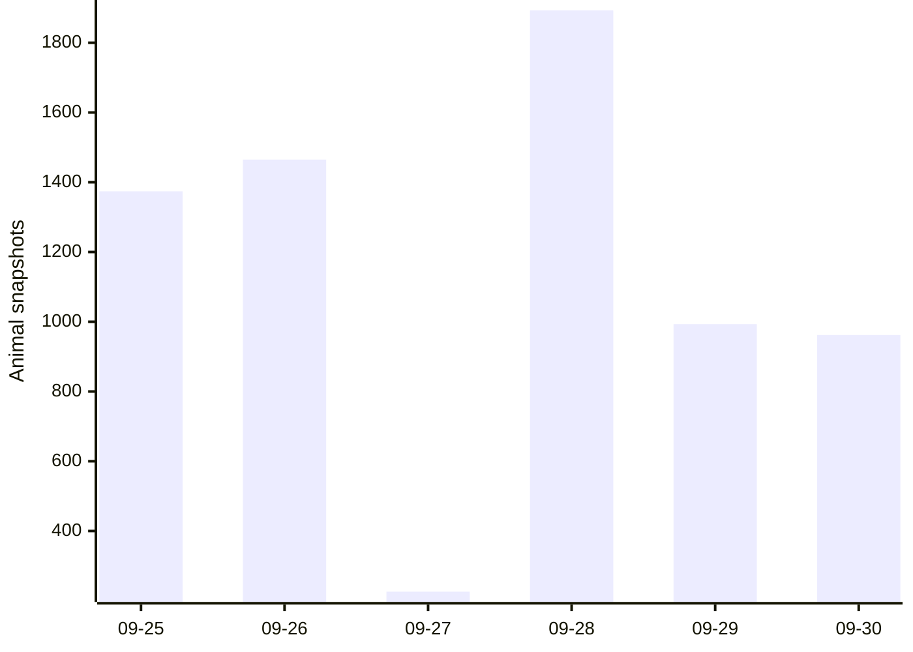
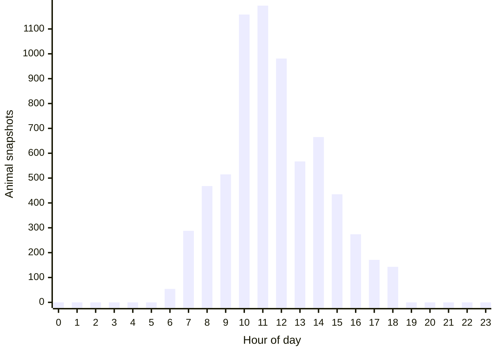
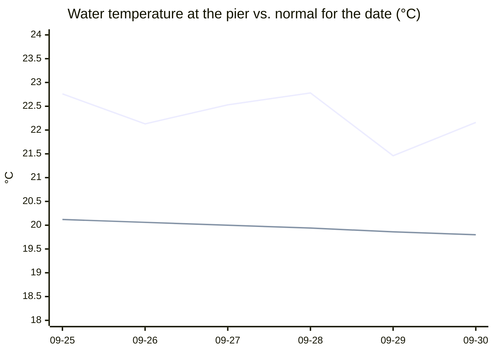

# PierTracker

Live cams from the Scripps Pier in La Jolla, California, as a Windows desktop wallpaper, plus an animal
tracker that watches the underwater cam and logs what swims by.

- **One monitor:** the [Scripps Pier cam](https://scripps.ucsd.edu/piercam) over La Jolla Shores.
- **The other:** the [Under Scripps Pier cam](https://coollab.ucsd.edu/pierviz/), about 4 m down on a piling.
- **The tracker** looks at the underwater cam every 2 seconds, finds and names fish, octopus, lobsters,
  rays, sea lions and more, and records them next to the conditions at the pier (water temperature,
  turbidity, tide, El Niño). What it isn't sure of goes to a person. The summary below updates daily.
- **Rewind:** the underwater video is kept on the PC for about two days, so anything seen on it can be
  watched again, frame by frame, and kept.

A project by Joshua Frommeyer, built with Claude ([how](#how-this-was-built)). It stays out of the way:
Windows Efficiency mode, models on the otherwise idle Intel GPU, and everything unloads while a game runs.

## Tracking results

<!-- RESULTS:START -->
_Last updated 2026-09-30 23:28 (Pacific). Tracking since 2026-09-25._ Last frame analyzed 2026-09-30 23:28:44.

| | |
|---|---|
| Days tracked | 6 |
| Snapshots analyzed (one every 12 s while streaming) | 23,599 |
| Daylight footage analyzed | 43.6 h |
| ...of it in poor visibility: fish counted, not named | 13.3 h |
| Daylight too murky to see anything (not counted) | 0.0 h |
| Animal types seen repeatedly or confirmed | 40 |

### Animals seen

- **Most at once (MaxN)**: the most of that animal in one frame, i.e. how many were certainly there.
  It's the standard head count for underwater cameras: a fish that swims out and back can't be
  counted twice. (What no camera count can do is recognize a particular fish, e.g. whether today's
  kelp bass is yesterday's.) For schools of small fish it's a rough, rounded estimate.
- **Encounters**: separate visits. Sightings less than 30 minutes apart are one encounter, the usual
  camera-trap rule, so a kelp bass that stays for an hour is one encounter.
- **Snapshots**: how many snapshots (one every 12 s) it was in, i.e. how long it was around.
  The frames in between (every 2 s) catch animals that pass quickly: those count as encounters.
- **Visibility**: the tracker judges how far it can see by how well the pilings stand out. In poor
  visibility (the far pilings gone) fish are counted but not named, so for a species the **%** is of
  the snapshots it could have been named in; too murky to see anything doesn't count as looking.

Names come from BioCLIP 2.5, a general model of living things. A classifier trained on this camera's own pictures takes over each animal once it has 12+ review answers (retrained nightly, and used only where it beats BioCLIP). So far 2 have enough (blacksmith, kelp bass), from 84 answers. **Checked**: how many of the names a person has checked, and how many were right. Listed: animals a person confirmed or seen repeatedly (10+ snapshots or 3+ encounters). Sightings found wrong by checking the pictures are corrected.

| Animal | Type | Encounters | Snapshots | % of snapshots | Most at once (MaxN) | Days seen | First seen | Last seen | Checked |
|---|---|---:|---:|---:|---:|---:|---|---|---|
| small fish (school) | fish | — | 3,088 | 23.61% | 600 | 6 | 2026-09-25 | 2026-09-30 | — |
| fish (unidentified) | fish | — | 1,155 | 8.83% | 4 | 6 | 2026-09-25 | 2026-09-30 | — |
| California spiny lobster | invertebrate | 16 | 1,077 | 11.84% | 1 | 6 | 2026-09-25 | 2026-09-30 | not yet |
| blacksmith | fish | 17 | 554 | 6.09% | 4 | 5 | 2026-09-25 | 2026-09-30 | 6 of 6 right |
| kelp bass | fish | 18 | 230 | 2.53% | 2 | 6 | 2026-09-25 | 2026-09-30 | 12 of 12 right |
| sea basses | fish | 12 | 124 | 0.95% | 1 | 4 | 2026-09-27 | 2026-09-30 | not yet |
| silversides & sardines | fish | 17 | 111 | 0.85% | 4 | 5 | 2026-09-25 | 2026-09-30 | not yet |
| salema | fish | 18 | 76 | 0.84% | 4 | 4 | 2026-09-25 | 2026-09-30 | 1 of 1 right |
| blacksmith (school) | fish | 10 | 49 | 0.54% | 9 | 4 | 2026-09-25 | 2026-09-30 | 6 of 6 right |
| fish (unidentified) (school) | fish | — | 45 | 0.34% | 12 | 6 | 2026-09-25 | 2026-09-30 | — |
| wrasses (senorita, sheephead) | fish | 21 | 45 | 0.34% | 2 | 5 | 2026-09-26 | 2026-09-30 | not yet |
| Pacific sardine | fish | 15 | 41 | 0.45% | 2 | 4 | 2026-09-25 | 2026-09-30 | not yet |
| rays | shark/ray | 13 | 34 | 0.26% | 1 | 4 | 2026-09-26 | 2026-09-30 | not yet |
| bat ray | shark/ray | 6 | 30 | 0.33% | 1 | 4 | 2026-09-25 | 2026-09-30 | not yet |
| jack mackerel | fish | 13 | 29 | 0.32% | 2 | 5 | 2026-09-26 | 2026-09-30 | not yet |
| rock wrasse | fish | 14 | 24 | 0.26% | 1 | 4 | 2026-09-26 | 2026-09-30 | not yet |
| damselfishes (garibaldi, blacksmith) | fish | 15 | 21 | 0.16% | 3 | 5 | 2026-09-25 | 2026-09-30 | not yet |
| giant kelpfish | fish | 11 | 20 | 0.22% | 2 | 4 | 2026-09-25 | 2026-09-30 | not yet |
| jacksmelt | fish | 11 | 20 | 0.22% | 2 | 4 | 2026-09-25 | 2026-09-30 | 1 of 1 right |
| diamond stingray | shark/ray | 12 | 16 | 0.18% | 1 | 4 | 2026-09-27 | 2026-09-30 | not yet |
| grunts (salema, sargo) | fish | 9 | 12 | 0.09% | 2 | 4 | 2026-09-25 | 2026-09-30 | not yet |
| opaleye | fish | 8 | 9 | 0.10% | 1 | 4 | 2026-09-25 | 2026-09-30 | not yet |
| mackerels & bonito | fish | 7 | 8 | 0.06% | 1 | 4 | 2026-09-25 | 2026-09-30 | not yet |
| yellowtail amberjack | fish | 6 | 8 | 0.09% | 1 | 3 | 2026-09-26 | 2026-09-30 | not yet |
| jellyfish | invertebrate | 6 | 7 | 0.05% | 1 | 3 | 2026-09-28 | 2026-09-30 | not yet |
| market squid | invertebrate | 8 | 7 | 0.08% | 1 | 2 | 2026-09-28 | 2026-09-30 | not yet |
| finescale triggerfish | fish | 4 | 4 | 0.04% | 1 | 2 | 2026-09-25 | 2026-09-30 | not yet |
| topsmelt | fish | 3 | 4 | 0.04% | 1 | 3 | 2026-09-25 | 2026-09-27 | not yet |
| queenfish | fish | 6 | 4 | 0.04% | 1 | 4 | 2026-09-26 | 2026-09-30 | not yet |
| black sea nettle jellyfish | invertebrate | 5 | 4 | 0.04% | 1 | 3 | 2026-09-26 | 2026-09-30 | not yet |
| surfperches | fish | 4 | 4 | 0.03% | 2 | 3 | 2026-09-28 | 2026-09-30 | not yet |
| octopus | invertebrate | 4 | 4 | 0.04% | 1 | 1 | 2026-09-30 | 2026-09-30 | not yet |
| garibaldi | fish | 3 | 3 | 0.03% | 1 | 2 | 2026-09-25 | 2026-09-28 | not yet |
| sargo | fish | 3 | 3 | 0.03% | 1 | 2 | 2026-09-25 | 2026-09-28 | 0 of 1 right |
| bullseye pufferfish | fish | 5 | 3 | 0.03% | 1 | 3 | 2026-09-26 | 2026-09-30 | 0 of 1 right |
| sheep crab | invertebrate | 5 | 3 | 0.03% | 1 | 3 | 2026-09-27 | 2026-09-30 | not yet |
| sea chubs (opaleye, halfmoon) | fish | 3 | 3 | 0.02% | 1 | 3 | 2026-09-28 | 2026-09-30 | not yet |
| senorita | fish | 3 | 3 | 0.03% | 1 | 2 | 2026-09-28 | 2026-09-30 | not yet |
| Pacific barracuda | fish | 3 | 2 | 0.02% | 1 | 3 | 2026-09-25 | 2026-09-30 | not yet |
| salema (school) | fish | 2 | 2 | 0.02% | 5 | 2 | 2026-09-25 | 2026-09-28 | 1 of 1 right |
| leopard shark | shark/ray | 5 | 2 | 0.02% | 1 | 3 | 2026-09-28 | 2026-09-30 | not yet |
| barred sand bass | fish | 1 | 1 | 0.01% | 1 | 1 | 2026-09-25 | 2026-09-25 | 1 of 1 right |
| Pacific bonito | fish | 3 | 1 | 0.01% | 1 | 2 | 2026-09-25 | 2026-09-30 | not yet |
| small fish | fish | — | 0 | 0.00% | 1 | 1 | 2026-09-29 | 2026-09-29 | — |

Seen briefly and not yet checked: 20 more names

The model's guesses for things it saw only briefly. Until a person confirms one, treat these as
unverified: many will turn out to be a better-known fish seen at an odd angle.

| Animal | Encounters | Snapshots | First seen | Last seen |
|---|---:|---:|---|---|
| croakers | 2 | 2 | 2026-09-25 | 2026-09-29 |
| Pacific chub mackerel | 2 | 2 | 2026-09-25 | 2026-09-26 |
| pile perch | 2 | 2 | 2026-09-25 | 2026-09-28 |
| shiner perch | 1 | 2 | 2026-09-26 | 2026-09-26 |
| sharks | 2 | 2 | 2026-09-27 | 2026-09-29 |
| zebra-perch sea chub | 2 | 2 | 2026-09-28 | 2026-09-28 |
| halfmoon | 1 | 1 | 2026-09-25 | 2026-09-25 |
| silversides & sardines (school) | 1 | 1 | 2026-09-25 | 2026-09-25 |
| California scorpionfish | 1 | 1 | 2026-09-25 | 2026-09-25 |
| spotfin croaker | 1 | 1 | 2026-09-26 | 2026-09-26 |
| shovelnose guitarfish | 2 | 1 | 2026-09-27 | 2026-09-30 |
| purple-striped jellyfish | 2 | 1 | 2026-09-28 | 2026-09-30 |
| flatfishes | 1 | 1 | 2026-09-29 | 2026-09-29 |
| Pacific sea nettle jellyfish | 1 | 1 | 2026-09-30 | 2026-09-30 |
| green sea turtle | 1 | 1 | 2026-09-30 | 2026-09-30 |
| California sea hare | 1 | 1 | 2026-09-30 | 2026-09-30 |
| giant sea bass | 1 | 1 | 2026-09-30 | 2026-09-30 |
| banded guitarfish | 1 | 0 | 2026-09-30 | 2026-09-30 |
| white seaperch | 1 | 0 | 2026-09-30 | 2026-09-30 |
| round stingray | 1 | 0 | 2026-09-30 | 2026-09-30 |

Charts: sightings per day, and by hour of day

#### Sightings per day (up to the last 14 days)

```mermaid
xychart-beta
    x-axis ["09-25", "09-26", "09-27", "09-28", "09-29", "09-30"]
    y-axis "Animal snapshots"
    bar [1374, 1465, 226, 1893, 993, 962]
```

#### When animals show up (all days, Pacific time)

```mermaid
xychart-beta
    x-axis "Hour of day" [0, 1, 2, 3, 4, 5, 6, 7, 8, 9, 10, 11, 12, 13, 14, 15, 16, 17, 18, 19, 20, 21, 22, 23]
    y-axis "Animal snapshots"
    bar [0, 0, 0, 0, 0, 0, 54, 288, 468, 515, 1158, 1194, 981, 567, 665, 435, 274, 171, 143, 0, 0, 0, 0, 0]
```

Daily numbers: [`results/daily_summary.csv`](results/daily_summary.csv). Learning from the data: [what brings animals in](results/conditions_model.md) (fitted once there are 3 weeks of data), the [camera-trained classifier](results/camera_classifier.md) and the [reference-photo classifier](results/reference_probe.md) (in shadow mode until it beats the names on review answers).

### Conditions at the pier

**2026-09-30:** water 22.2 °C at ~5 m, **+2.4 °C** vs. normal for the date. Turbidity 0.46 NTU, chlorophyll 0.48 µg/L. El Niño index **+1.8** (El Niño). Underwater visibility: clear enough to name fish (poor for 0.3 of 10.5 daylight hours).

Water temperature chart, and daily conditions for the last 14 days

```mermaid
xychart-beta
    title "Water temperature at the pier vs. normal for the date (°C)"
    x-axis ["09-25", "09-26", "09-27", "09-28", "09-29", "09-30"]
    y-axis "°C" 18 --> 24
    line [22.76, 22.13, 22.53, 22.78, 21.46, 22.16]
    line [20.12, 20.06, 20.0, 19.94, 19.86, 19.8]
```

_Upper line: this year. Lower line: the 2013–2025 normal for each date._

| Date | Water °C | vs. normal | Turbidity (NTU) | Camera visibility | Chlorophyll (µg/L) | Salinity | Oxygen (mg/L) | pH | Tide range (m) | Animal snapshots |
|---|---:|---:|---:|---|---:|---:|---:|---:|---:|---:|
| 2026-09-25 | 22.8 | +2.6 | 0.28 | clear | 0.50 | 33.44 | 7.25 | 7.97 | 1.57 | 1,374 |
| 2026-09-26 | 22.1 | +2.1 | 0.24 | clear | 0.47 | 33.43 | 7.26 | 7.96 | 1.52 | 1,465 |
| 2026-09-27 | 22.5 | +2.5 | 0.35 | clear | 0.55 | 33.44 | 7.20 | 7.96 | 1.69 | 226 |
| 2026-09-28 | 22.8 | +2.8 | 0.56 | clear | 0.52 | 33.46 | 7.12 | 7.96 | 1.80 | 1,893 |
| 2026-09-29 | 21.5 | +1.6 | 1.24 | poor (11.9 h poor) | 0.72 | 33.43 | 7.25 | 7.96 | 1.82 | 993 |
| 2026-09-30 | 22.2 | +2.4 | 0.46 | clear | 0.48 | 33.47 | 7.17 | 7.96 | 1.18 | 962 |

Sources: SCCOOS shore station on the pier (water; quality-controlled readings only), NOAA La Jolla tide gauge, NOAA Oceanic Niño Index. Every day: [`results/daily_conditions.csv`](results/daily_conditions.csv); hourly, to join with the hourly sightings: [`results/environment_hourly.csv`](results/environment_hourly.csv).

### Confirmed by hand

Sightings the tracker wasn't sure about are saved for review. These were checked by a person: 12 confirmed as the animal below, 0 rejected (not an animal). They are listed here separately and not added to the counts above.

| Animal | Confirmed | Last confirmed |
|---|---:|---|
| blacksmith | 10 | 2026-09-25 |
| salema | 1 | 2026-09-25 |
| kelp bass | 1 | 2026-09-25 |

### Validation (hand-checked samples)

23 of the tracker's names checked by a person so far; 91% were named correctly.

| Animal | Checked | Correct | Precision |
|---|---:|---:|---:|
| kelp bass | 12 | 12 | 100% |
| blacksmith | 6 | 6 | 100% |
| sargo | 1 | 0 | 0% |
| barred sand bass | 1 | 1 | 100% |
| jacksmelt | 1 | 1 | 100% |
| salema | 1 | 1 | 100% |
| bullseye pufferfish | 1 | 0 | 0% |
<!-- RESULTS:END -->

## How it works, in short

1. **The wallpaper** (`host/`, C# and WebView2) shows each cam's official page, trimmed to its player, in
   the desktop's wallpaper layer. It saves a frame of the underwater cam every 2 s, and keeps the video
   pieces its player downloads for rewinding.
2. **The tracker** (`tracker/`, Python and OpenVINO) looks at each frame. One every 10 s is a *snapshot*,
   the basis of the statistics; the frames in between catch whatever passes quickly. It skips night and
   murky water, ignores what doesn't move or only sways (pilings, hanging growth, flickering water),
   boxes fish with the [Community Fish Detector](https://github.com/filippovarini/community-fish-detector)
   and names animals with [BioCLIP 2.5](https://huggingface.co/imageomics/bioclip-2.5-vith14).
3. **A person has the last word.** Unsure sightings, and a sample of sure ones, go to a review window with
   reference photos to compare. The answers correct the statistics and train a classifier on this
   camera's own pictures, which takes over animal by animal.
4. **Every night** at 10 pm it fetches the day's conditions, retrains, publishes this summary and backs up
   the data.

More: [how it works](docs/HOW_IT_WORKS.md) · [how well it works](docs/VALIDATION.md) ·
[setup, settings and files](docs/SETUP_AND_USE.md) · [learning SQL on this data](docs/SQL_WALKTHROUGH.md)

## How far to trust the names

- On photos of 25 local species made to look like this camera, 81% of the names it logged were right.
  It logs what it isn't sure of as unidentified, or a look-alike group, rather than guess.
- Live footage is harder (green, blurry, backlit). That's what the **Checked** column measures, and why
  names are corrected when a picture shows they were wrong.
- It knows when it can't see well. It judges visibility the way a diver would, by how well the pilings
  stand out: when the far ones disappear (green water on 2026-09-29) it counts fish without naming them,
  and when only the nearest one shows it stops identifying altogether. Each day's visibility is in the
  results, and the tray icon shows it live.
- Its known traps, and how each is handled, are in [validation](docs/VALIDATION.md): a lobster's antenna
  called a stingray, swaying growth called a leopard shark, empty water and dusk noise called an octopus.

## Using it

**Setup:** double-click **`Set up and start LiveCams.bat`**. It installs what's missing, restores the data
from the Google Drive backup if there is one, builds everything and starts it; it's safe to run any time.
[By hand](docs/SETUP_AND_USE.md#setup).

Everything is in the tray icon's menu (a wave):

| Menu | What it does |
|---|---|
| Review uncertain sightings | Confirm or correct what the tracker wasn't sure of, with reference photos side by side |
| Rewind the underwater cam | Play back the kept video by the clock: jump to a time, step frame by frame, keep a clip or a picture |
| Just saw something? Keep the last 5 minutes | Keeps them for good and opens the rewind window a minute back |
| Pause cams + tracker | For demanding games (full-screen games pause everything by themselves) |
| Turn off | Freezes each monitor on its current picture and stops everything |

The command line and every setting: [setup and use](docs/SETUP_AND_USE.md).

## How this was built

PierTracker is Joshua Frommeyer's project. The idea, the questions it asks (what lives under the pier, and
how that changes with water temperature, turbidity, tides and this year's El Niño), and the decisions
about what counts, how it's checked and what gets published come from Joshua. The code was written with
Claude, which is why the commits list Claude as a co-author. Uncertain identifications go to a person,
and the validation and caveats here are there because a model's guesses aren't taken on trust.

## Credits

- **Cams:** [Scripps Institution of Oceanography](https://scripps.ucsd.edu/piercam) (UC San Diego). The
  underwater cam is run by Scripps' [Coastal Ocean Observing Lab](https://coollab.ucsd.edu/pierviz/) and
  streamed by [HDOnTap](https://hdontap.com/). The pier cam is by [Surfline](https://www.surfline.com/).
  This project only displays their official players. Frames and video stay on the local PC (the video
  is deleted after about two days unless a clip is kept) and only summary numbers are published.
- **Models:**
  - [Community Fish Detector](https://github.com/filippovarini/community-fish-detector) (Apache-2.0)
    on [RF-DETR](https://github.com/roboflow/rf-detr) (Apache-2.0)
  - [BioCLIP 2.5](https://huggingface.co/imageomics/bioclip-2.5-vith14) by Imageomics (MIT), loaded with
    [OpenCLIP](https://github.com/mlfoundations/open_clip)
- **Conditions data:**
  - NOAA CO-OPS, tide station 9410230 La Jolla (public domain).
  - NOAA Climate Prediction Center, Oceanic Niño Index (public domain).
  - SCCOOS Automated Shore Station, Scripps Pier, served by CeNCOOS. Free to use and redistribute; please
    credit CeNCOOS and NOAA. Not for legal use; the providers give no warranty.
- **Runtime:** [OpenVINO](https://github.com/openvinotoolkit/openvino) (Apache-2.0),
  [WebView2](https://developer.microsoft.com/microsoft-edge/webview2/), and
  [hls.js](https://github.com/video-dev/hls.js) (Apache-2.0, bundled in `host/viewer/`) to play back the kept video.

## License

[MIT](LICENSE). The cam footage and the model weights keep their own terms (see Credits).
