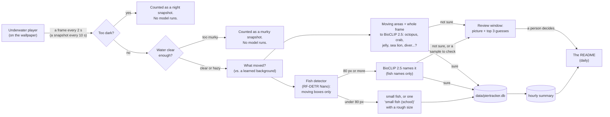

# How it works

The details behind the [README](../README.md). How well it works is in [VALIDATION.md](VALIDATION.md);
setting it up and every setting are in [SETUP_AND_USE.md](SETUP_AND_USE.md).

## The wallpaper (`host/`, the LiveCams app)

A small C# (.NET 8, WinForms) app opens one borderless window per monitor and places it in the
desktop's wallpaper layer, behind the icons. Each window is a WebView2 (Edge) browser that loads the
cam's **official page** and restyles it so only the video player shows, full-screen. Because the page
really is the official one, the embedded players run exactly as the site intends. No second stream is
opened and nothing is rebroadcast. The underwater video is kept on this PC for a day or two so it can be
rewound (see [Rewind](#rewind-hostrewindcs)).

- **Scripps Pier cam (Surfline player):** Scripps set this player to pause itself after 5 minutes.
  LiveCams follows that pause. It only resumes the player while someone is actually looking: the monitor
  isn't mostly covered by a window, and there was keyboard or mouse input in the last 2 minutes.
- **Underwater cam (HDOnTap player):** the stream keeps running so the tracker always has frames. To keep
  the desktop calm (at night it's just sensor noise), the picture freezes after 5 minutes. Click the
  desktop on that monitor to go live again.
- **Click the empty desktop** on either monitor to resume that cam, or reload it if the player broke.
- **Full-screen apps (games, videos):** every cam is swapped for a still image and the players are unloaded:
  0% CPU, no network, no GPU. They come back 20 s after the full-screen app closes.
- Analytics, ad and captcha scripts on the cam pages are blocked. None of them are needed to show the cams.
- The app restarts itself if Explorer restarts or the monitor setup changes, and reloads a cam whose
  video stops advancing for 3 minutes. If the cams ever drop off the desktop without that notice, it
  rebuilds them within a minute. A shutdown that fails partway is logged and finished anyway, and one
  that hangs is cut off after 30 s, so the restart can't get stuck.

## Rewind (`host/Rewind.cs`)

The underwater player streams the video as 10-second pieces (HLS: MPEG-TS, 1920×1080, 30 fps, ~4.8
Mbit/s). As the player downloads each piece, LiveCams saves a copy to `video/rewind/<date>/`, named by
when it's on screen. Nothing is re-encoded and no second stream is opened, so it costs almost nothing but
disk space: ~35 MB a minute, ~2.1 GB an hour.

- **How much is kept:** up to 50 GB (`rewind.maxGB`), about 24 hours of video, i.e. the last two days'
  daylight. The oldest piece is deleted first, and sooner if the drive would drop below 50 GB free
  (`rewind.minFreeGB`). Night isn't kept: while the tracker says the frames are dark, pieces are skipped.
  Nothing is kept while the cams are paused or a game runs, since the player isn't loaded then.
- **The clock:** the player shows each piece ~20–30 s after downloading it. A piece that follows the last
  one starts where that one ended; the first after a break starts when the player's buffer says it will
  be on screen. Checked against the tracker's frames, the labels were within a second of what was shown.
- **The rewind window** (tray: **Rewind the underwater cam...**, or `LiveCams.exe --rewind`) plays it back
  by the clock with [hls.js](https://github.com/video-dev/hls.js) (bundled in `host/viewer/`): a timeline
  of everything kept, a clock for the moment on screen, jumps of 10 s and 1 min, frame steps, 0.25–16×
  speed, and "go to" a clock time. Breaks (night, games) are marked on the timeline.
- **Keeping things:** **Keep this moment** saves 2 minutes before and 1 minute after to `video/saved/`
  as an .mp4 (if [ffmpeg](https://ffmpeg.org/) is installed, else a .ts that VLC or Windows Media Player
  plays); **Save picture** saves the frame on screen. The tray's **Just saw something? Keep the last 5
  minutes** keeps those right away, then opens the rewind window a minute back.
  Nothing in `video/saved/` is ever deleted automatically.

## How the tracker finds and names animals (`tracker/`)

1. **Frame capture.** The wallpaper copies the current video frame straight from the player (1920×1080,
   without logos or overlays) to `frames/underwater/latest.jpg` every 2 s. No second stream is opened.
   One frame every ~10 s is a **snapshot**: the statistics (snapshots seen, % of clear-water snapshots,
   hourly effort) use snapshots only, at the same pace as since tracking began. The four frames in
   between catch what passes quickly (step 9).
2. **Night skip.** The tracker shrinks the frame to 64×36 and checks brightness, detail and color. At
   night the camera shows only purple-grey noise, and in daylight the water here is green. **Twilight**
   counts as night too: at dawn and dusk the picture turns to grainy grey noise before it goes dark, and
   the model called that noise "octopus" at 99%. Its colour saturation drops to 70–110 (of 255), while
   daylight frames, however dim, are 175+. Night frames are counted but never reach a model.
3. **Murky water.** Every frame gets a **visibility** score: how much fine detail is left (edges of
   pilings, fish, growth), which murky water washes out. Clear water here scores 2–3. It's averaged over
   3 frames so the state doesn't flicker.
   - **Hazy** (below 1.4): fish and schools are still counted, but no species are named. Only a
     look-alike group at 95%+ is logged, and nothing goes to the review queue, since a person couldn't
     judge it either.
   - **Too murky** (below 0.2): nothing is identified. The frame is logged as murky, like a night frame,
     and it doesn't count as effort. A murky day then reads "couldn't see", not "no fish".
   - The cutoffs come from a test (see Validation): as simulated murk increased, naming accuracy fell
     from 92% to 50% long before detection gave out.
4. **Motion.** The camera never moves, so the tracker keeps a slowly updated background of the scene,
   covering roughly the last 100 seconds, and marks what changed. Pilings, the rope hanging from the pier
   and the growth on them never move. The live test showed they are the main source of false sightings,
   so anything that didn't move is ignored.
   - **Fixed things that sway.** Some structure does move: growth hanging off the crossbeam and a round
     growth on the right-hand piling sway in the surge (and the camera itself sways a little), and the
     model named them with high confidence ("leopard shark", "green sea turtle 100%"). Two things tell
     them apart from animals:
     - a **long-term background**: the median of one clear frame every 5 minutes over the last hour.
       Everything fixed is in it; a passing fish isn't. But neither is a lobster that has sat in its
       crevice for half an hour, so this alone can't decide.
     - a **gallery of what people confirmed**: every review picture marked "not an animal" (a fixture)
       or approved as an animal, with where it was.

     A crop that looks like a confirmed fixture at the same place (and like the background there) is
     ignored. A crop that looks like the background at a place **nobody has confirmed** isn't logged:
     it goes to the review queue, so a person decides whether it's swaying growth or a lobster sitting
     still. Everything else is logged as usual. Each review answer makes the next decision automatic.
   - **Look-alikes of confirmed animals.** The model has never been taught what a spiny lobster's
     antenna looks like through this water, and called it a stingray or a ray. A crop that looks almost
     exactly like a picture a person confirmed as a non-fish animal, at the same place (similarity 0.82+),
     is logged as that animal instead. On the first day's review pictures that caught about 14 of 17
     antenna pictures and none of 155 others; a text label for "lobster antenna" had helped only 1 in 15.
     Fish names are left to the camera-trained classifier.
     See Validation, section 4.
5. **Fish.** [Community Fish Detector](https://github.com/filippovarini/community-fish-detector)
   (RF-DETR Nano, 640 px, trained on 30+ community fish datasets) boxes fish above 0.35 confidence, and
   only boxes where something moved are kept.
   - **Under 80 px** (most of the school, silhouetted against the surface) isn't named. Nobody can tell a
     topsmelt from a sardine at that size. When there are five or more, the whole school is logged once
     per snapshot as **small fish (school)**. Its size is estimated by counting the small moving specks,
     because the detector only boxes a few of them. The estimate is rounded (~150, ~400) to avoid false
     precision. Fewer than five are logged as **small fish**.
   - **80 px and up** is cropped and embedded by [BioCLIP 2.5](https://huggingface.co/imageomics/bioclip-2.5-vith14),
     a vision model trained on the Tree of Life that can match an image against species names it has never
     been fine-tuned on (zero-shot). The crop is compared only with the **fish** among the 72 animals in
     [`tracker/species.json`](../tracker/species.json), plus 9 "not an animal" labels (murky water, kelp, pier
     piling...). So a blurry fish can't come out as an octopus.
   - **Look-alike groups.** Many mistakes are between look-alikes: topsmelt vs. jacksmelt vs. anchovy vs.
     sardine, or opaleye vs. halfmoon. So when no species reaches **0.85** but the model is sure it's one
     of a group (their probabilities add up to **0.90+**), the **group** is logged instead: "silversides &
     sardines", "surfperches", "sea basses", "grunts (salema, sargo)" and so on (see `species.json`).
     Otherwise it's **fish (unidentified)**. One species has a stricter cutoff (`min_prob`): rock wrasse
     is only named at **0.97**, since at 0.85 it took blacksmith's name; below that it's the wrasse group.
   - **Following fish across frames.** While a fish big enough to name is in view, the frames between
     snapshots take another look at it. Detections close to where the fish was a moment ago are treated
     as the same fish, and it's named from the **average of all its looks**, which is steadier than any
     single frame. In a test that was ~5 points more accurate (see [Validation](VALIDATION.md)). Each
     fish becomes one row in the database's `visits` table (arrival, departure, looks, name). Other
     animals (a lobster on the piling, a turtle, a seal) are one visit as long as they keep showing up
     within 5 minutes.
   - Once the **camera-trained classifier** has learned from enough review answers (see
     [Learning from the data](#learning-from-the-data)), its answer is used first for the animals it
     knows.
6. **Everything else.** The fish detector doesn't box octopus, crabs, lobsters, jellyfish, sea hares,
   sea lions or divers. So the biggest moving areas (larger than a small fish), and the whole frame when a
   lot of it moved, are compared against every label (72 animals + 9 "not an animal"). A "scene" animal
   (marked in `species.json`) counts when it wins with at least 0.70 probability. In a small moving area
   it needs 0.90, or it has to show up again within 30 s: a real lobster stays put, but a flicker of fish
   at a piling edge doesn't.
   - **Open water isn't looked at.** Light flickering on open water moves too, and the model called
     those patches "octopus" at 90–97%. A moving area whose detail at the scale of an animal's outline
     (the difference between a lightly and a heavily blurred copy) is below 0.55 is skipped: those patches
     scored 0.28–0.45, and every kind of fish in the saved crops scored 0.64 or more.
7. **A person has the last word.** Two kinds of pictures go to the review window (`data/review/pending`):
   - **"Not sure"**: a fish whose best name scored 0.25–0.85, or a non-fish between 0.40 and the bar
     above. It is logged as unidentified, or not at all, until someone looks.
   - **"Is this right?"**: a sample of the names the tracker *did* log. At most one per animal per hour,
     plus every rare non-fish sighting. The answers are the published accuracy.

   Each picture shows the close-up, where it was in the frame, and the top 3 guesses. There are at most
   ~10 an hour, and at most 300 waiting. When 300 are waiting, a picture of something rare (fewer than 5 of
   its kind waiting) replaces the oldest picture of whatever has the most waiting, so an octopus isn't
   turned away because 30 blacksmith pictures are ahead of it. See
   [Reviewing uncertain sightings](SETUP_AND_USE.md#reviewing-uncertain-sightings).
8. **Logging.** Everything goes into one place, the SQLite database `data/piertracker.db` (see
   [The database](#the-database-sql)), where every write is all-or-nothing:
   - `snapshots`: every snapshot, including dark and murky ones, so rates can be computed fairly
     (`regular = 1`), plus the frames in between where something was found (`regular = 0`).
   - `sightings`: one row per animal type per snapshot, with the count, confidence and `method`: how it
     was named, `zero-shot` (BioCLIP), `camera-trained`, or `detector only` (small or unidentified fish).
   - Five or more of one named kind in a snapshot is one row flagged as a school, shown as
     **"<kind> (school)"**, for example "blacksmith (school)", with the count.
   - Once a day, `tracker/publish_results.py` summarizes it per hour and per day into the README's results
     and `results/*.csv`, and pushes them. The statistics start at 2026-09-25 10:01, when the current
     model took over; earlier snapshots stay in the database.
9. **Between snapshots.** An octopus jetting across the screen takes ~2 s, and snapshots 10 s apart
   missed one on 2026-09-27. So the four frames between two snapshots are checked too, cheaply first: the
   motion check alone (no model) looks for a **new, solid** moving area, i.e. bigger than a small fish,
   at least 30% of its box changed (a passing animal, not the loose specks of a school), not a fish
   already being followed, not a fixture that sways and not open water. Only then does the frame get the
   full look a snapshot gets. What it finds is recorded in a frame with `regular = 0`: it counts toward
   **encounters**, **most at once** and first/last seen, but not toward snapshots, so the time-based
   numbers mean the same as before. The frames in between spend at most 15 minutes of model time per
   hour (a quarter of the otherwise idle Intel iGPU), including following fish.

Both models are converted once to [OpenVINO](https://github.com/openvinotoolkit/openvino) (half
precision). The running tracker needs only OpenVINO, NumPy and Pillow, not PyTorch. It runs the models on
the Intel integrated GPU when there is one, and never on a discrete card. Without one, it uses two CPU
efficiency cores.

## Conditions at the pier (`tracker/environment.py`)

Once a day the tracker fetches hourly conditions from two public, quality-controlled sources on the pier
itself, and saves them next to the sightings (`data/environment_hourly.csv`, published as
[`results/environment_hourly.csv`](../results/environment_hourly.csv)):

| Source | Measures | Notes |
|---|---|---|
| [NOAA tide gauge 9410230 "La Jolla"](https://tidesandcurrents.noaa.gov/stationhome.html?id=9410230) | Predicted tide and observed water level (m above MLLW), rising/falling, water and air temperature, wind, air pressure | Official NOAA data |
| [SCCOOS Automated Shore Station, Scripps Pier](https://sccoos.org/autoss/) | Water temperature, salinity, dissolved oxygen, pH, turbidity, chlorophyll | Sensors ~5 m deep, next to the camera's ~4 m. Only readings that passed the station's [QARTOD](https://ioos.noaa.gov/project/qartod/) quality tests are kept |
| Same shore station, daily means since 2013 | **Temperature anomaly**: how much warmer or colder than normal the water is for that date | Normal for each date = 2013–2025 mean, smoothed ±15 days. Late September's normal is ~20 °C; on 2026-09-25 the water was **+2.6 °C** above it |
| [NOAA Oceanic Niño Index (ONI)](https://www.cpc.ncep.noaa.gov/data/indices/oni.ascii.txt) | The official El Niño / La Niña measure (El Niño at +0.5 or more) | 2026 is an El Niño year: ONI +1.8 for Jun–Aug, and NOAA's El Niño Advisory gives >90% odds of a very strong event this fall and winter |

The sources were checked before use:
- On the first day, NOAA's water temperature (22.5 °C) and the shore station's (22.46 °C) agreed.
- One of the station's two chlorophyll sensors wasn't reporting, so the working one is used.
- About 12% of turbidity readings fail quality control, and those are dropped.

Each value is the median of that hour's readings. Two public files, from the least to the most detail:
- [`results/daily_conditions.csv`](../results/daily_conditions.csv): one row per day, with water temperature
  (mean, min, max, normal for the date, anomaly), turbidity, chlorophyll, salinity, oxygen, pH, tide
  range, air temperature, wind, the El Niño index, and that day's clear/murky tracking effort and
  sightings. The README shows the headline, with a temperature chart and the table folded under it.
- [`results/environment_hourly.csv`](../results/environment_hourly.csv): every hour, to join with the hourly
  sightings (`results/hourly_summary.csv`) on `date` + `hour`. Recording through a strong El Niño makes this a good season to
start: warm-water visitors and missing regulars should both show up against the temperature anomaly.

## What the numbers mean

- **Most at once (MaxN)** is the head count: the most of that animal in a single frame, i.e. how many
  were certainly there. It's the standard count for underwater video (baited remote underwater video
  surveys use it) because it never counts a fish twice. What no camera count can do is recognize a
  particular fish: it can't tell whether today's kelp bass is yesterday's, and adding up sightings
  would count one lingering fish hundreds of times. For a school of small fish it's a rounded estimate
  from the moving specks: right in order of magnitude (a hundred vs. a few hundred), not exact.
- **Encounters** are separate visits: sightings of the same animal less than 30 minutes apart are one
  encounter, the usual camera-trap rule for independent detections. Two encounters can still be the
  same fish coming back.
- A **snapshot** is one frame every ~10 s. **Snapshots seen** measures presence over time: a garibaldi
  that stays for a minute is in about 6. Frames between snapshots count toward encounters and MaxN,
  never toward snapshots, so this means the same as when tracking began.
- Animals that never move (anemones, mussels on the piling) aren't in the species list on purpose.

## The database (SQL)

Everything the tracker sees also goes into a SQLite database, `data/piertracker.db`, with these tables:
- `snapshots`: every analyzed frame, with its visibility and whether it was dark or murky
- `visits`: each fish followed across frames, from arrival to leaving
- `sightings`
- `species`
- `conditions`
- `reviews`: answers from the review window, with who gave them (`reviewer`)

Questions that combine them are one query. For example, which hours had kelp bass while the water was
2 °C above normal? The CSVs stay for the public results; the database is the place to explore.

- `tracker\.venv\Scripts\python tracker\sql.py` opens a small SQL shell on a **sandbox copy**, which
  you can break freely (`.reset` for a fresh copy). Add `--live` for the live database, read-only.
- [`docs/SQL_WALKTHROUGH.md`](SQL_WALKTHROUGH.md) teaches SQL with this data: filtering, grouping,
  joins, rates vs. counts, views and window functions.

## Learning from the data

Both pieces are built, tested, and run automatically. They switch themselves on when there's enough data.
A nightly job (`tracker/nightly.py`) runs at 10 pm at idle priority, after the day's daylight and even while
LiveCams is paused (if the PC was off or asleep, as soon as LiveCams is running again). It runs:

1. `environment.py`: fetches the day's conditions.
2. `ml/train_classifier.py`: retrains the camera classifier from the review answers.
3. `ml/conditions_model.py`: refits "what brings animals in".
4. `publish_results.py`: updates the README's results (if publishing is on).
5. Backs up the database, review answers and frame bank to `tracker.backupDir` (if set).

### Camera-trained classifier (`tracker/ml/train_classifier.py`)

BioCLIP matches pictures against species *names*. It has never seen this camera's green-blue, blurry,
backlit footage, which is where its overconfidence comes from. Every review picture stores BioCLIP's
image embedding (1,024 numbers describing the picture), and your answer is its label.

- **How it trains:** a logistic regression on those embeddings learns what each animal looks like *on
  this camera*. "Not an animal" answers are a class too, so it also learns to throw away piling edges.
- **When it switches on:** an animal is learned at **12 answers** (~30 makes it reliable), and it needs
  at least 3 animals. The classifier is only used if it beats zero-shot BioCLIP by 5+ points in
  cross-validation on the same pictures.
- **How it's used:** the tracker picks it up automatically and uses its answer when it's 70%+ sure. Every
  sighting records which method named it.
- **Progress:** the review window shows the answer count. The report is at
  [`results/camera_classifier.md`](../results/camera_classifier.md); run
  `tracker\.venv\Scripts\python tracker\ml\train_classifier.py --status` to check it anytime.
- **Tested** on synthetic data: it trains, cross-validates, beats the baseline and switches on.

### What brings animals in (`tracker/ml/conditions_model.py`)

For each animal seen in 30+ hours, this fits a logistic regression of **whether it was seen at all in
each clear daylight hour** (yes/no), with that hour's amount of clear footage as a predictor (more
looking finds more). Yes/no per hour rather than snapshot counts, because the tracker can't tell
individuals apart: one kelp bass that hangs around the camera for an hour would otherwise look like
hundreds of sightings. The other predictors are:
- how much warmer than normal the water is (the local El Niño signal)
- turbidity and chlorophyll
- tide height, and whether it's rising
- time of day
- the El Niño index, once the data spans months where it changes

Results are odds ratios per typical (1 SD) change with 95% intervals, in
[`results/conditions_model.md`](../results/conditions_model.md). It starts after **21 days** of data.

- **Tested** on 20 synthetic data sets with two made-up animals: one really shows up more in warm water
  (odds × 2.0 per SD), the other shows up just as often but **lingers longer** when it's warm.

  | | Old model (snapshot counts) | This model (seen in the hour, yes/no) |
  |---|---|---|
  | Shows up more when warm (truth 2.0) | underestimated | median 2.24; interval covered 2.0 in 18/20 |
  | Only lingers longer (truth: no effect) | "effect" found in **20/20** (median 1.79) | "effect" found in 1/20, the expected 5% (median 1.01) |

  The first version counted snapshots and would have reported that lingering fish "like warm water".
- **Caveats:** it shows associations, not causes. Neighbouring hours aren't independent, so the intervals
  are optimistic.

### Reference-photo classifier (`tracker/ml/reference_photos.py`, shadow mode)

A small classifier trained on ~500 underwater iNaturalist photos of 48 of the species, degraded to look
like this camera, plus crops of this camera's own background as "not an animal". On held-out photos it
named 60.5% of the fish correctly against 49.0% for names alone, with no false alarms on this camera's
background (against 17.8%). Those are simulated conditions, so it runs in **shadow mode**: every review
picture carries its opinion next to the tracker's, and each night it's compared with people's answers
([`results/reference_probe.md`](../results/reference_probe.md)). It gets switched on only after beating the
names by 5+ points on at least 30 answers. One weakness is already visible: an antenna poking out of the
lobster's crevice looks like background to it.

### Next steps once there's a season of data

- **Occupancy models** separate "not there" from "there but too murky to see", using turbidity and time
  of day as detection covariates.
- **Forecasts:** the odds of a sea lion or a ray in the next hour, given the tide and conditions now.
- **A detector fine-tuned on this camera's small fish** would count schools much better than the
  motion-speck estimate. Two pieces of prior work point the way:
  - **Pretraining on our own footage.** [Li et al. 2025, *Self-Supervised Marine Organism
    Detection*](https://doi.org/10.1109/JOE.2024.3455565) pretrain a detector's backbone on 40,000
    *unlabeled* underwater images, with underwater-style augmentations (CLAHE, Retinex, motion blur) used
    during training, then fine-tune it on a few labels. For that, the tracker banks frames from this
    camera: one every 20 min, plus one every 5 min while a named animal is in view
    (`data/frame_bank/`, 90 days).
  - **Labeling tools.** NOAA's protected-species work uses [VIAME](https://www.viametoolkit.org/) and
    its DIVE annotation tool, with the same human-in-the-loop active learning as the review queue here.
    DIVE is a good way to draw boxes on banked frames.

## Performance

Measured on the machine this runs on: i7-13700K, Radeon RX 7800 XT, Intel UHD 770, 32 GB RAM.

| State | CPU | GPU | RAM |
|---|---|---|---|
| Both cams live + tracker (between frames) | ~0.8% of total CPU | Radeon: 0.25% 3D; video decode on its separate decode engine | ~3.2 GB |
| Tracker, per daytime frame | ~0.03–0.1 s of CPU time | ~1–3 s on the Intel iGPU with BioCLIP 2.5 (more when many fish are close) | (included above) |
| Tracker, per night frame | ~0 (no model runs) | none | models unloaded after 10 min dark: ~1.1 GB freed |
| Full-screen game or app running | 0.0% (re-measured 2026-09-28: 0.00 s of CPU in 30 s) | none | ~0.7 GB, idle (tracker models unloaded after 10 min) |
| Turned off (`--off`) | nothing running | none | 0 |

Since 2026-09-28 (the rows above were measured before):
- **A frame every 2 s** instead of every 10 s. At night, with a frame every 10 s, everything together
  used 0.2% of one core (0.01% of total CPU). The frames in between cost the tracker a motion check each
  (no model) and at most 15 minutes of Intel iGPU time per hour when something new moves. Their daytime
  CPU cost is to be measured.
- **Video kept for rewinding:** a copy of what the player already downloads, with no decoding or
  re-encoding: ~0.6 MB/s written to disk in daylight, about 26 GB a day, deleted after about two days.

How it stays light:
- Every process runs in Windows **Efficiency mode**: idle priority plus EcoQoS, which keeps it on the
  efficiency cores.
- The tracker's GPU calls use OpenVINO's low-priority queue, so the CPU sleeps while the iGPU works
  instead of spinning. Measured: 156 ms → 3–25 ms of CPU per model run.
- The desktop-click hook runs on its own time-critical thread, so it can never add mouse lag. It is removed
  entirely during games.
- If the app dies, a Windows job object takes the tracker down with it.
